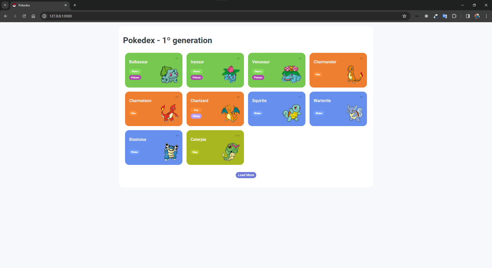
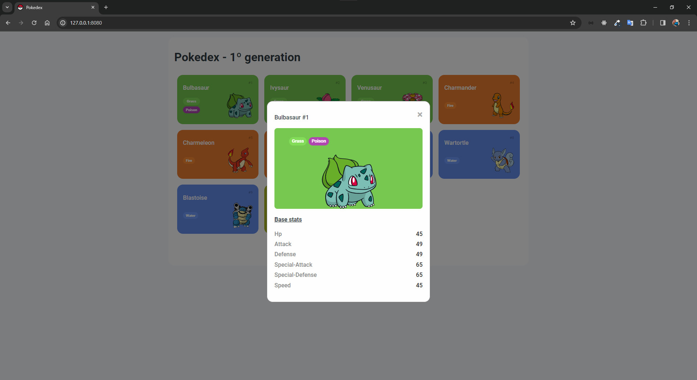
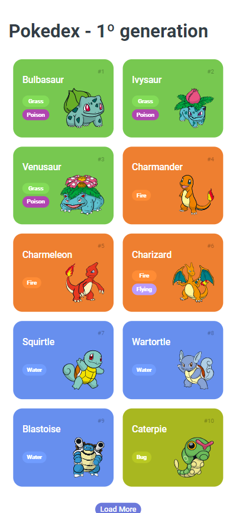
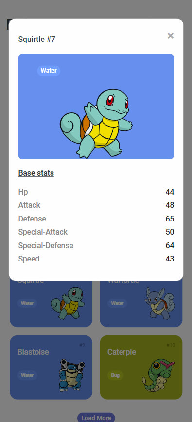

<h1>
    
     Trilha JS Developer - Pokedex
</h1>

## Projeto

Consumindo uma API REST para a criação de uma Pokédex.

## Versão desktop

</a>
</a>

## Versão mobile

</a>
</a>

## Tecnologias

<code></code>
<code></code>
<code></code>

